# CBTrading: System Architecture & Project Overview

## Project Summary

**CBTrading** is a comprehensive commission-based middleman marketplace platform. The system manages transactions between agricultural suppliers and customers, handling inventory, payments, and commission calculations. The platform processes ~5,000 transactions daily with multiple frontends for different user types.

---

## System Architecture Overview

```
┌─────────────────────────────────────────────────────────────────────┐
│                         CBTrading Platform                          │
├─────────────────────────────────────────────────────────────────────┤
│                                                                     │
│  ┌─────────────┐  ┌─────────────┐  ┌─────────────┐  ┌──────────┐ │
│  │   Supplier  │  │  Admin/     │  │   Customer  │  │  Mobile  │ │
│  │  Dashboard  │  │  Middleman  │  │  Dashboard  │  │   App    │ │
│  │ (React)     │  │  Dashboard  │  │  (React)    │  │(Flutter) │ │
│  │             │  │  (React)    │  │             │  │          │ │
│  └──────┬──────┘  └──────┬──────┘  └──────┬──────┘  └────┬─────┘ │
│         │                │                │              │        │
│         └────────────────┼────────────────┼──────────────┘        │
│                          │                │                       │
│                   ┌──────v────────────────v──────┐                │
│                   │   API Gateway / REST API     │                │
│                   │   (Java Spring Boot)         │                │
│                   └──────┬────────────┬───────────┘                │
│                          │            │                           │
│         ┌────────────────┴───┬────────┴────────────────┐          │
│         │                    │                         │          │
│    ┌────v───────┐   ┌───────v────────┐   ┌──────────v─────┐     │
│    │ Auth       │   │ Transaction    │   │ Box/Inventory  │     │
│    │ Service    │   │ Service        │   │ Service        │     │
│    └────────────┘   └────────────────┘   └────────────────┘     │
│         │                    │                       │            │
│    ┌────v───────┐   ┌───────v────────┐   ┌──────────v─────┐     │
│    │ User/Role  │   │ Order          │   │ Box Tracking   │     │
│    │ Management │   │ Management     │   │ Management     │     │
│    └────────────┘   └────────────────┘   └────────────────┘     │
│         │                    │                       │            │
│         └────────────────┬───┴───────────────────────┘            │
│                          │                                        │
│                   ┌──────v──────────────┐                         │
│                   │   MySQL 8 / InnoDB  │                         │
│                   │   (Primary Data)    │                         │
│                   └────────────────────┘                          │
│                                                                     │
│  Optional Services:                                               │
│  • Redis Cache (Performance)                                      │
│  • Message Queue (Async Processing)                               │
│  • File Storage (Reports, Invoices)                               │
│                                                                     │
└─────────────────────────────────────────────────────────────────────┘
```

---

## Frontend Applications

### 1. **Admin/Middleman Dashboard** (Implemented ✓)
- **Technology:** React + Vite + Tailwind CSS
- **Location:** `/Portal`
- **Features:**
  - Box inventory management and tracking
  - Sales settlement & commission calculations
  - Supplier management and coordination
  - Customer management and credit tracking
  - Transaction history and reporting
  - Dashboard analytics

### 2. **Supplier Dashboard** (Planned)
- **Technology:** React + Vite + Tailwind CSS
- **Features:**
  - View product deliveries
  - Track sales performance
  - Monitor commission earnings
  - Manage box returns
  - Payment history

### 3. **Customer/Retail App** (Planned)
- **Technology:** React + Vite + Tailwind CSS
- **Features:**
  - Browse product catalog
  - Place orders
  - Track purchases
  - Manage credit account
  - Payment tracking

### 4. **Mobile App** (Future)
- **Technology:** Flutter (Cross-platform iOS/Android)
- **Features:**
  - Quick order placement
  - Push notifications
  - Offline-first capability
  - Payment integration

---

## Backend Services Architecture

```
┌─────────────────────────────────────────────────────────────┐
│              Java Spring Boot Backend                        │
├─────────────────────────────────────────────────────────────┤
│                                                             │
│  ┌──────────────────────────────────────────────────────┐  │
│  │              REST API Controllers                    │  │
│  ├──────────────────────────────────────────────────────┤  │
│  │  • AuthController       • TransactionController      │  │
│  │  • UserController       • BoxInventoryController     │  │
│  │  • SupplierController   • PaymentController          │  │
│  │  • CustomerController   • ReportController           │  │
│  └──────────────────────────────────────────────────────┘  │
│                          │                                 │
│  ┌──────────────────────────────────────────────────────┐  │
│  │              Service Layer                           │  │
│  ├──────────────────────────────────────────────────────┤  │
│  │  • AuthService              • TransactionService     │  │
│  │  • UserService              • CommissionService      │  │
│  │  • SupplierService          • BoxService             │  │
│  │  • CustomerService          • PaymentService         │  │
│  │  • ReportService            • NotificationService    │  │
│  └──────────────────────────────────────────────────────┘  │
│                          │                                 │
│  ┌──────────────────────────────────────────────────────┐  │
│  │              Repository Layer (Data Access)         │  │
│  ├──────────────────────────────────────────────────────┤  │
│  │  • UserRepository           • TransactionRepository  │  │
│  │  • SupplierRepository       • BoxRepository          │  │
│  │  • CustomerRepository       • PaymentRepository      │  │
│  │  • OrderRepository          • SettlementRepository   │  │
│  └──────────────────────────────────────────────────────┘  │
│                          │                                 │
│  ┌──────────────────────────────────────────────────────┐  │
│  │              Database Models/Entities                │  │
│  ├──────────────────────────────────────────────────────┤  │
│  │  • User                     • Transaction            │  │
│  │  • Supplier                 • Order                  │  │
│  │  • Customer                 • Box                    │  │
│  │  • Product                  • Payment/Settlement     │  │
│  └──────────────────────────────────────────────────────┘  │
│                                                             │
└─────────────────────────────────────────────────────────────┘
```

---

## Data Flow: Complete Transaction Journey

```
┌─────────────────────────────────────────────────────────────────┐
│  TRANSACTION LIFECYCLE IN CBTRADING                             │
├─────────────────────────────────────────────────────────────────┤
│                                                                 │
│  1. PRODUCT ARRIVAL                                             │
│     ├─ Supplier sends products in boxes                         │
│     ├─ Admin receives & records inventory                       │
│     └─ Box status: "In Storage"                                 │
│                          │                                      │
│                          v                                      │
│  2. PRODUCT DISPLAY                                             │
│     ├─ Admin adds product to system                             │
│     ├─ Frontend displays available products                     │
│     └─ Customer browses catalog                                 │
│                          │                                      │
│                          v                                      │
│  3. CUSTOMER ORDER                                              │
│     ├─ Customer selects items                                   │
│     ├─ Payment: Cash or Credit                                  │
│     └─ Order created in system                                  │
│                          │                                      │
│                          v                                      │
│  4. FULFILLMENT                                                 │
│     ├─ Products packed in box                                   │
│     ├─ Box assigned to customer                                 │
│     └─ Box status: "With Customer"                              │
│                          │                                      │
│                          v                                      │
│  5. SETTLEMENT & COMMISSION                                     │
│     ├─ Daily/Weekly settlement calculated                       │
│     ├─ Sales total → Supplier Account (95%)                     │
│     ├─ Commission earned → Middleman (5%)                       │
│     ├─ Box tracking status updated                              │
│     └─ Payment recorded                                         │
│                          │                                      │
│                          v                                      │
│  6. BOX RETURN/TRACKING                                         │
│     ├─ Customer returns empty box                               │
│     ├─ Box status: "In Storage"                                 │
│     └─ Box available for reuse                                  │
│                                                                 │
└─────────────────────────────────────────────────────────────────┘
```

---

## Key System Components

### **User Types & Roles**

```
┌─────────────────────────────────────────────────────────────┐
│                    USER ECOSYSTEM                           │
├─────────────────────────────────────────────────────────────┤
│                                                             │
│  ADMIN/MIDDLEMAN                                            │
│  ├─ Manages all suppliers                                   │
│  ├─ Manages all customers                                   │
│  ├─ Tracks inventory & boxes                                │
│  ├─ Calculates commissions                                  │
│  └─ Generates reports & settlements                         │
│                                                             │
│  SUPPLIER                                                   │
│  ├─ Sends product orders                                    │
│  ├─ Tracks deliveries                                       │
│  ├─ Monitors commission earnings                            │
│  └─ Manages box returns                                     │
│                                                             │
│  CUSTOMER (Retail)                                          │
│  ├─ Permanent customers (credit)                            │
│  ├─ Cash customers                                          │
│  ├─ Places orders                                           │
│  └─ Tracks purchases & payments                             │
│                                                             │
└─────────────────────────────────────────────────────────────┘
```

### **Box Inventory System**

```
TOTAL BOXES OWNED
    ├─ In Storage (Ready for use)
    ├─ With Suppliers (Delivery)
    ├─ With Customers (Product delivery)
    └─ Lost/Damaged/Missing

REAL-TIME TRACKING: Every box movement logged
```

### **Commission Model**

```
Sales Revenue = 100%
├─ Supplier Gets = 95% (Producer earnings)
├─ Middleman Commission = 5% (Service fee)
└─ Calculated on total sales volume
```

---

## Deployment Architecture

```
┌─────────────────────────────────────────────────────────────┐
│                   DEPLOYMENT STRUCTURE                      │
├─────────────────────────────────────────────────────────────┤
│                                                             │
│  FRONTEND TIER (CDN/Static)                                 │
│  ├─ Admin Dashboard (React SPA)                             │
│  ├─ Supplier Dashboard (React SPA)                          │
│  ├─ Customer Dashboard (React SPA)                          │
│  └─ Mobile App (Native/Flutter)                             │
│                                                             │
│  API TIER (Java Spring Boot)                                │
│  ├─ Load Balancer                                           │
│  ├─ Multiple API instances (horizontal scaling)             │
│  └─ Health checks & auto-recovery                           │
│                                                             │
│  DATA TIER                                                  │
│  ├─ MySQL 8 / InnoDB (Primary database)                     │
│  ├─ Redis (Cache layer)                                     │
│  ├─ Backup & replication                                    │
│  └─ Read replicas for reporting                             │
│                                                             │
│  SUPPORTING SERVICES                                        │
│  ├─ Message Queue (Order processing)                        │
│  ├─ File Storage (Invoices, reports)                        │
│  └─ Email/SMS Gateway (Notifications)                       │
│                                                             │
└─────────────────────────────────────────────────────────────┘
```

---

## Technology Stack

| Layer | Technology |
|-------|-----------|
| **Frontend (Web)** | React 18, Vite, Tailwind CSS, Context API |
| **Frontend (Mobile)** | Flutter, Dart |
| **Backend** | Java Spring Boot, Spring Data JPA |
| **Database** | MySQL 8+ / InnoDB |
| **Cache** | Redis (optional) |
| **Message Queue** | RabbitMQ/Kafka (optional) |
| **API** | REST (JSON), potentially GraphQL |
| **Authentication** | JWT tokens, OAuth2 |
| **Deployment** | Docker, Kubernetes (optional) |

---

## Production MySQL Schema

The production data model uses **MySQL 8 / InnoDB**, role-based access, and strict
`wholesaler_id` scoping. The current portal is a wholesaler workspace. Admin is a
platform role that creates wholesalers and assigns access.

Roles:

- **ADMIN**: platform owner/operator. Creates wholesalers and manages users.
- **WHOLESALER**: stockist/wholesaler user. Can only read/write rows under their assigned `wholesaler_id`.

Core rules:

```text
Every business table must carry wholesaler_id.
Every wholesaler API query must filter by wholesaler_id.
Operational writes must use database transactions.
Ledger tables are the source of truth.
Balance tables are current summaries for fast dashboard reads.
transactions and payments are high-volume partitioned tables.
```

### Role-Based Multi-Wholesaler ERD

```mermaid
erDiagram
    USERS {
        BIGINT id PK
        VARCHAR name
        VARCHAR email UK
        VARCHAR phone
        VARCHAR password_hash
        ENUM role "ADMIN, WHOLESALER"
        BIGINT wholesaler_id FK "nullable for ADMIN"
        ENUM status "ACTIVE, DISABLED"
        DATETIME created_at
        DATETIME updated_at
    }

    WHOLESALERS {
        BIGINT id PK
        VARCHAR name
        VARCHAR phone
        TEXT address
        ENUM status "ACTIVE, DISABLED"
        DATETIME created_at
        DATETIME updated_at
    }

    SUPPLIERS {
        BIGINT id PK
        BIGINT wholesaler_id FK
        VARCHAR name
        VARCHAR phone
        TEXT address
        DECIMAL commission_rate
        ENUM status "ACTIVE, DISABLED"
        DATETIME created_at
        DATETIME updated_at
    }

    CUSTOMERS {
        BIGINT id PK
        BIGINT wholesaler_id FK
        VARCHAR name
        VARCHAR owner_name
        VARCHAR phone
        TEXT address
        ENUM customer_type "PERMANENT"
        DECIMAL jamanot_balance
        ENUM status "ACTIVE, DISABLED"
        DATETIME created_at
        DATETIME updated_at
    }

    PRODUCTS {
        BIGINT id PK
        BIGINT wholesaler_id FK
        BIGINT supplier_id FK
        VARCHAR name
        VARCHAR category
        ENUM unit "PCS, KG, DOZEN, BOX"
        DECIMAL default_unit_price
        ENUM status "IN_STOCK, STOCK_OUT, DISABLED"
        DATETIME created_at
        DATETIME updated_at
    }

    PRODUCT_STOCKS {
        BIGINT id PK
        BIGINT wholesaler_id FK
        BIGINT product_id FK
        DECIMAL quantity
        DECIMAL average_cost
        DATETIME updated_at
    }

    STOCK_LEDGER {
        BIGINT id PK
        BIGINT wholesaler_id FK
        BIGINT product_id FK
        ENUM reference_type "SUPPLIER_DELIVERY, SALE, ADJUSTMENT"
        BIGINT reference_id
        ENUM direction "IN, OUT"
        DECIMAL quantity
        DECIMAL unit_price
        TEXT note
        DATETIME created_at
    }

    SUPPLIER_DELIVERIES {
        BIGINT id PK
        BIGINT wholesaler_id FK
        BIGINT supplier_id FK
        DATETIME delivery_date
        DECIMAL total_value
        TEXT note
        DATETIME created_at
    }

    SUPPLIER_DELIVERY_ITEMS {
        BIGINT id PK
        BIGINT wholesaler_id FK
        BIGINT delivery_id FK
        BIGINT product_id FK
        DECIMAL quantity
        DECIMAL unit_price
        DECIMAL line_total
    }

    SALES {
        BIGINT id PK
        BIGINT wholesaler_id FK
        BIGINT customer_id FK
        DATETIME sale_date
        DECIMAL gross_amount
        DECIMAL paid_amount
        DECIMAL due_amount
        INT wooden_boxes_given
        INT plastic_boxes_given
        DECIMAL jamanot_charged
        ENUM status "POSTED, CANCELLED"
        DATETIME created_at
    }

    SALE_ITEMS {
        BIGINT id PK
        BIGINT sale_id FK
        BIGINT wholesaler_id FK
        BIGINT supplier_id FK
        BIGINT product_id FK
        DECIMAL quantity
        DECIMAL unit_price
        DECIMAL line_total
        DECIMAL commission_rate
        DECIMAL commission_amount
    }

    TRANSACTIONS {
        BIGINT id PK
        BIGINT wholesaler_id FK
        ENUM transaction_type "SALE, PAYMENT"
        BIGINT sale_id FK
        BIGINT payment_id FK
        BIGINT supplier_id FK
        BIGINT customer_id FK
        DECIMAL sale_amount
        DECIMAL payment_amount
        TEXT description
        DATETIME created_at PK
    }

    PAYMENTS {
        BIGINT id PK
        BIGINT wholesaler_id FK
        ENUM party_type "CUSTOMER, SUPPLIER"
        BIGINT party_id
        ENUM payment_mode "CASH_RECEIVE, BOX_RECEIVE, CASH_AND_BOX_RECEIVE, CASH_PAY"
        ENUM cash_direction "IN, OUT, NONE"
        DECIMAL cash_amount
        INT wooden_boxes_received
        INT plastic_boxes_received
        DECIMAL jamanot_amount
        ENUM payment_method "CASH, BANK, BKASH, NAGAD, OTHER, NONE"
        TEXT note
        DATETIME created_at PK
    }

    ACCOUNT_LEDGER {
        BIGINT id PK
        BIGINT wholesaler_id FK
        ENUM party_type "CUSTOMER, SUPPLIER"
        BIGINT party_id
        ENUM reference_type "SALE, PAYMENT, SUPPLIER_COMMISSION, EXPENSE, DUE_ADJUSTMENT"
        BIGINT reference_id
        DECIMAL debit
        DECIMAL credit
        TEXT note
        DATETIME created_at
    }

    ACCOUNT_BALANCES {
        BIGINT id PK
        BIGINT wholesaler_id FK
        ENUM party_type "CUSTOMER, SUPPLIER"
        BIGINT party_id
        DECIMAL balance
        DATETIME updated_at
    }

    EXPENSE_CATEGORIES {
        BIGINT id PK
        BIGINT wholesaler_id FK
        VARCHAR name
        ENUM status "ACTIVE, DISABLED"
    }

    SUPPLIER_EXPENSES {
        BIGINT id PK
        BIGINT wholesaler_id FK
        BIGINT supplier_id FK
        BIGINT category_id FK
        DECIMAL amount
        DECIMAL paid_amount
        DECIMAL due_amount
        TEXT note
        DATETIME expense_date
        DATETIME created_at
    }

    OTHER_DUE_BALANCES {
        BIGINT id PK
        BIGINT wholesaler_id FK
        BIGINT supplier_id FK
        BIGINT category_id FK
        DECIMAL due_amount
        DATETIME updated_at
    }

    BOX_TYPES {
        BIGINT id PK
        BIGINT wholesaler_id FK
        VARCHAR name
        ENUM status "ACTIVE, DISABLED"
    }

    BOX_INVENTORY {
        BIGINT id PK
        BIGINT wholesaler_id FK
        BIGINT box_type_id FK
        INT total_owned
        INT in_hand
        INT with_customers
        INT with_suppliers
        INT lost_damaged
        DATETIME updated_at
    }

    BOX_LEDGER {
        BIGINT id PK
        BIGINT wholesaler_id FK
        BIGINT box_type_id FK
        ENUM party_type "CUSTOMER, SUPPLIER, WHOLESALER"
        BIGINT party_id
        ENUM movement_type "PURCHASE, GIVEN_TO_CUSTOMER, RETURNED_FROM_CUSTOMER, GIVEN_TO_SUPPLIER, RETURNED_FROM_SUPPLIER, LOST, DAMAGED, ADJUSTMENT"
        INT quantity
        ENUM reference_type "SALE, PAYMENT, MANUAL, SUPPLIER_DELIVERY"
        BIGINT reference_id
        TEXT note
        DATETIME created_at
    }

    BOX_BALANCES {
        BIGINT id PK
        BIGINT wholesaler_id FK
        ENUM party_type "CUSTOMER, SUPPLIER"
        BIGINT party_id
        BIGINT box_type_id FK
        INT boxes_due
        DATETIME updated_at
    }

    WHOLESALERS ||--o{ USERS : "has wholesaler users"
    WHOLESALERS ||--o{ SUPPLIERS : "owns"
    WHOLESALERS ||--o{ CUSTOMERS : "owns"
    WHOLESALERS ||--o{ PRODUCTS : "owns"
    WHOLESALERS ||--o{ SUPPLIER_DELIVERIES : "receives"
    WHOLESALERS ||--o{ SALES : "records"
    WHOLESALERS ||--o{ TRANSACTIONS : "dashboard ledger"
    WHOLESALERS ||--o{ PAYMENTS : "records"
    WHOLESALERS ||--o{ ACCOUNT_LEDGER : "owns"
    WHOLESALERS ||--o{ ACCOUNT_BALANCES : "summarizes"
    WHOLESALERS ||--o{ EXPENSE_CATEGORIES : "defines"
    WHOLESALERS ||--o{ SUPPLIER_EXPENSES : "records"
    WHOLESALERS ||--o{ OTHER_DUE_BALANCES : "summarizes"
    WHOLESALERS ||--o{ BOX_TYPES : "defines"
    WHOLESALERS ||--o{ BOX_INVENTORY : "tracks"
    WHOLESALERS ||--o{ BOX_LEDGER : "records"
    WHOLESALERS ||--o{ BOX_BALANCES : "summarizes"

    SUPPLIERS ||--o{ PRODUCTS : "supplies"
    SUPPLIERS ||--o{ SUPPLIER_DELIVERIES : "sends"
    SUPPLIER_DELIVERIES ||--o{ SUPPLIER_DELIVERY_ITEMS : "contains"
    SUPPLIERS ||--o{ SALE_ITEMS : "earns commission from"
    SUPPLIERS ||--o{ SUPPLIER_EXPENSES : "may owe expenses"
    CUSTOMERS ||--o{ SALES : "buys"
    PRODUCTS ||--|| PRODUCT_STOCKS : "current stock"
    PRODUCTS ||--o{ STOCK_LEDGER : "stock movements"
    PRODUCTS ||--o{ SUPPLIER_DELIVERY_ITEMS : "received as"
    PRODUCTS ||--o{ SALE_ITEMS : "sold as"
    SALES ||--o{ SALE_ITEMS : "contains"
    SALES ||--o{ TRANSACTIONS : "appears as sale"
    SALES ||--o{ STOCK_LEDGER : "reduces stock"
    SALES ||--o{ ACCOUNT_LEDGER : "creates customer due"
    PAYMENTS ||--o{ TRANSACTIONS : "appears as payment"
    PAYMENTS ||--o{ ACCOUNT_LEDGER : "settles due"
    PAYMENTS ||--o{ BOX_LEDGER : "may include box return"
    EXPENSE_CATEGORIES ||--o{ SUPPLIER_EXPENSES : "classifies"
    BOX_TYPES ||--o{ BOX_INVENTORY : "inventory by type"
    BOX_TYPES ||--o{ BOX_LEDGER : "movements by type"
    BOX_TYPES ||--o{ BOX_BALANCES : "due by type"
```



### Partitioned High-Volume Tables

`transactions` and `payments` must be partitioned because they grow fastest and are
used by dashboard filters, exports, and daily reports. Use monthly range partitions
on `created_at`. In MySQL, every unique key on a partitioned table must include the
partition column, so use composite primary keys such as `(id, created_at)`.

For MySQL partitioned tables, keep `sale_id`, `payment_id`, `supplier_id`, and
`customer_id` as indexed reference columns and enforce cross-table validity in the
service transaction. Do not depend on database foreign keys inside the partitioned
`transactions` and `payments` tables.

Recommended structure:

```sql
CREATE TABLE transactions (
  id BIGINT NOT NULL AUTO_INCREMENT,
  wholesaler_id BIGINT NOT NULL,
  transaction_type ENUM('SALE','PAYMENT') NOT NULL,
  sale_id BIGINT NULL,
  payment_id BIGINT NULL,
  supplier_id BIGINT NULL,
  customer_id BIGINT NULL,
  sale_amount DECIMAL(14,2) NOT NULL DEFAULT 0,
  payment_amount DECIMAL(14,2) NOT NULL DEFAULT 0,
  description TEXT NULL,
  created_at DATETIME NOT NULL,
  PRIMARY KEY (id, created_at),
  KEY idx_txn_wh_date (wholesaler_id, created_at),
  KEY idx_txn_wh_type_date (wholesaler_id, transaction_type, created_at),
  KEY idx_txn_wh_supplier_date (wholesaler_id, supplier_id, created_at),
  KEY idx_txn_wh_customer_date (wholesaler_id, customer_id, created_at)
)
PARTITION BY RANGE COLUMNS(created_at) (
  PARTITION p202605 VALUES LESS THAN ('2026-06-01'),
  PARTITION p202606 VALUES LESS THAN ('2026-07-01'),
  PARTITION pmax VALUES LESS THAN (MAXVALUE)
);

CREATE TABLE payments (
  id BIGINT NOT NULL AUTO_INCREMENT,
  wholesaler_id BIGINT NOT NULL,
  party_type ENUM('CUSTOMER','SUPPLIER') NOT NULL,
  party_id BIGINT NOT NULL,
  payment_mode ENUM('CASH_RECEIVE','BOX_RECEIVE','CASH_AND_BOX_RECEIVE','CASH_PAY') NOT NULL,
  cash_direction ENUM('IN','OUT','NONE') NOT NULL DEFAULT 'NONE',
  cash_amount DECIMAL(14,2) NOT NULL DEFAULT 0,
  wooden_boxes_received INT NOT NULL DEFAULT 0,
  plastic_boxes_received INT NOT NULL DEFAULT 0,
  jamanot_amount DECIMAL(14,2) NOT NULL DEFAULT 0,
  payment_method ENUM('CASH','BANK','BKASH','NAGAD','OTHER','NONE') NOT NULL DEFAULT 'CASH',
  note TEXT NULL,
  created_at DATETIME NOT NULL,
  PRIMARY KEY (id, created_at),
  KEY idx_pay_wh_party_date (wholesaler_id, party_type, party_id, created_at),
  KEY idx_pay_wh_date (wholesaler_id, created_at)
)
PARTITION BY RANGE COLUMNS(created_at) (
  PARTITION p202605 VALUES LESS THAN ('2026-06-01'),
  PARTITION p202606 VALUES LESS THAN ('2026-07-01'),
  PARTITION pmax VALUES LESS THAN (MAXVALUE)
);
```

Partition maintenance:

```text
Create the next monthly partition before each month starts.
Keep pmax as a safety partition.
Archive old partitions only after reports and audits are complete.
Never update created_at after insert.
```

### Accuracy Rules For High Volume

1. A wholesaler user can only read/write rows where `wholesaler_id` matches their assigned wholesaler.
2. Supplier product receiving must create `supplier_deliveries`, `supplier_delivery_items`, `stock_ledger`, `product_stocks`, and optional `box_ledger` rows in one database transaction.
3. A sale must create `sales`, `sale_items`, `stock_ledger`, customer `account_ledger`, supplier commission `account_ledger`, `account_balances`, optional `box_ledger`, `box_balances`, `box_inventory`, and one partitioned `transactions` row in one database transaction.
4. A customer payment may include cash, box return, and jamanot in one request. It must create one partitioned `payments` row, one partitioned `transactions` row, account ledger updates, box ledger updates, jamanot update, and balance updates atomically.
5. A supplier payment may settle commission due and/or supplier expense due. It must update `payments`, `account_ledger`, `account_balances`, `supplier_expenses` or `other_due_balances` when applicable.
6. Balance rows must be updated with row locking, for example `SELECT ... FOR UPDATE`, before changing due, stock, jamanot, or box balances.
7. The transaction dashboard should query the partitioned `transactions` table by `wholesaler_id`, date range, type, `supplier_id`, and `customer_id`.
8. Phone number search should first resolve `customers.phone` or `suppliers.phone` to ids, then query `transactions` by `customer_id` or `supplier_id`.

### Tenant Indexing Strategy

Every high-volume table should start important indexes with `wholesaler_id`.

```text
users:              (role), (wholesaler_id)
suppliers:          (wholesaler_id, phone), (wholesaler_id, status)
customers:          UNIQUE (wholesaler_id, phone), (wholesaler_id, status)
products:           (wholesaler_id, supplier_id), (wholesaler_id, status)
product_stocks:     UNIQUE (wholesaler_id, product_id)
stock_ledger:       (wholesaler_id, product_id, created_at)
supplier_deliveries:(wholesaler_id, supplier_id, delivery_date)
sales:              (wholesaler_id, sale_date), (wholesaler_id, customer_id, sale_date)
sale_items:         (wholesaler_id, supplier_id), (wholesaler_id, product_id)
transactions:       (wholesaler_id, created_at), (wholesaler_id, transaction_type, created_at), (wholesaler_id, supplier_id, created_at), (wholesaler_id, customer_id, created_at)
payments:           (wholesaler_id, party_type, party_id, created_at), (wholesaler_id, created_at)
account_ledger:     (wholesaler_id, party_type, party_id, created_at)
account_balances:   UNIQUE (wholesaler_id, party_type, party_id)
supplier_expenses:  (wholesaler_id, supplier_id, expense_date), (wholesaler_id, category_id, expense_date)
other_due_balances: UNIQUE (wholesaler_id, supplier_id, category_id)
box_ledger:         (wholesaler_id, party_type, party_id, created_at)
box_balances:       UNIQUE (wholesaler_id, party_type, party_id, box_type_id)
```

---

## Project Timeline & Milestones

```
┌────────────────────────────────────────────────────────┐
│                  DEVELOPMENT PHASES                    │
├────────────────────────────────────────────────────────┤
│                                                        │
│  PHASE 1: Foundation ✓ (COMPLETED)                    │
│  ├─ Backend: User, auth, basic services              │
│  ├─ Frontend: Admin dashboard demo                    │
│  └─ Database: Initial schema & setup                  │
│                                                        │
│  PHASE 2: Core Features (IN PROGRESS)                 │
│  ├─ Backend: Transaction, settlement, commission     │
│  ├─ Backend: Box inventory tracking                   │
│  ├─ Frontend: Complete admin features                │
│  └─ Integration testing                              │
│                                                        │
│  PHASE 3: Multi-Frontend Expansion (PLANNED)          │
│  ├─ Supplier dashboard                               │
│  ├─ Customer dashboard                               │
│  └─ Mobile app (Flutter)                              │
│                                                        │
│  PHASE 4: Optimization & Scaling (FUTURE)             │
│  ├─ Performance tuning                                │
│  ├─ Caching strategy                                  │
│  ├─ Load testing                                      │
│  └─ Deployment automation                             │
│                                                        │
└────────────────────────────────────────────────────────┘
```

---

## Key Metrics & Performance Targets

| Metric | Target | Notes |
|--------|--------|-------|
| **Daily Transactions** | ~5,000 | Peak capacity design |
| **API Response Time** | < 200ms | 95th percentile |
| **System Availability** | 99.5% | Uptime SLA |
| **Database Connections** | Connection pooling | Max 100 concurrent |
| **Cache Hit Ratio** | > 80% | For frequently accessed data |

---

## Security & Compliance

- **Authentication:** JWT-based with refresh tokens
- **Authorization:** Role-based access control (RBAC)
- **Data Encryption:** HTTPS/TLS for transit, encrypted storage
- **Database Security:** User isolation, SQL injection prevention
- **Audit Logging:** Transaction tracking for compliance
- **Payment Security:** PCI DSS compliance (if handling cards)

---

## Next Steps

1. Complete core backend services (transactions, settlements)
2. Build complete admin dashboard with all features
3. Develop supplier dashboard application
4. Develop customer dashboard application
5. Mobile app development (Flutter)
6. Performance optimization & load testing
7. Deployment & scaling infrastructure
