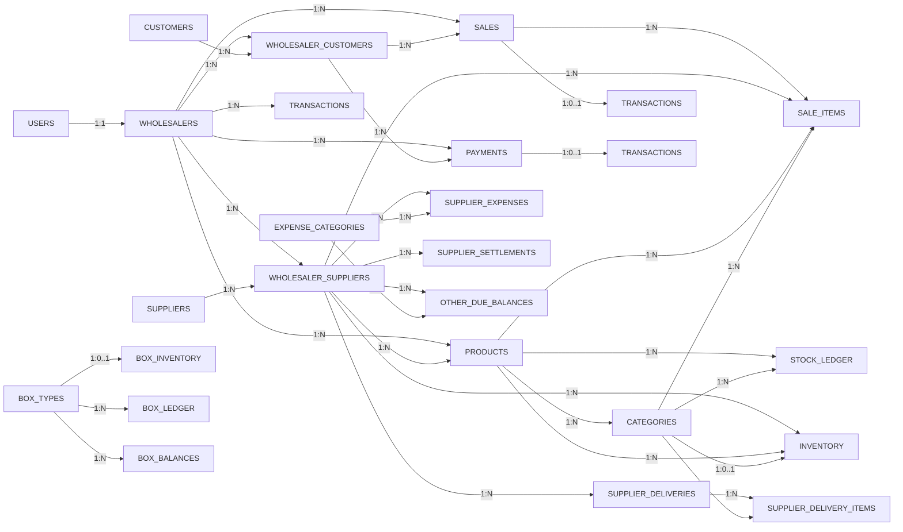

# CBTrading: System Architecture & Project Overview

## Project Summary

**CBTrading** is a comprehensive commission-based middleman marketplace platform. The system manages transactions between agricultural suppliers and customers, handling inventory, payments, and commission calculations. The platform processes ~5,000 transactions daily with multiple frontends for different user types.

---

## System Architecture Overview

```
┌─────────────────────────────────────────────────────────────────────┐
│                         CBTrading Platform                          │
├─────────────────────────────────────────────────────────────────────┤
│                                                                     │
│  ┌─────────────┐  ┌─────────────┐  ┌─────────────┐  ┌──────────┐ │
│  │   Supplier  │  │  Admin/     │  │   Customer  │  │  Mobile  │ │
│  │  Dashboard  │  │  Middleman  │  │  Dashboard  │  │   App    │ │
│  │ (React)     │  │  Dashboard  │  │  (React)    │  │(Flutter) │ │
│  │             │  │  (React)    │  │             │  │          │ │
│  └──────┬──────┘  └──────┬──────┘  └──────┬──────┘  └────┬─────┘ │
│         │                │                │              │        │
│         └────────────────┼────────────────┼──────────────┘        │
│                          │                │                       │
│                   ┌──────v────────────────v──────┐                │
│                   │   API Gateway / REST API     │                │
│                   │   (Java Spring Boot)         │                │
│                   └──────┬────────────┬───────────┘                │
│                          │            │                           │
│         ┌────────────────┴───┬────────┴────────────────┐          │
│         │                    │                         │          │
│    ┌────v───────┐   ┌───────v────────┐   ┌──────────v─────┐     │
│    │ Auth       │   │ Transaction    │   │ Box/Inventory  │     │
│    │ Service    │   │ Service        │   │ Service        │     │
│    └────────────┘   └────────────────┘   └────────────────┘     │
│         │                    │                       │            │
│    ┌────v───────┐   ┌───────v────────┐   ┌──────────v─────┐     │
│    │ User/Role  │   │ Order          │   │ Box Tracking   │     │
│    │ Management │   │ Management     │   │ Management     │     │
│    └────────────┘   └────────────────┘   └────────────────┘     │
│         │                    │                       │            │
│         └────────────────┬───┴───────────────────────┘            │
│                          │                                        │
│                   ┌──────v──────────────┐                         │
│                   │   MySQL 8 / InnoDB  │                         │
│                   │   (Primary Data)    │                         │
│                   └────────────────────┘                          │
│                                                                     │
│  Optional Services:                                               │
│  • Redis Cache (Performance)                                      │
│  • Message Queue (Async Processing)                               │
│  • File Storage (Reports, Invoices)                               │
│                                                                     │
└─────────────────────────────────────────────────────────────────────┘
```

---

## Frontend Applications

### 1. **Admin/Middleman Dashboard** (Implemented ✓)
- **Technology:** React + Vite + Tailwind CSS
- **Location:** `/Portal`
- **Features:**
  - Box inventory management and tracking
  - Sales settlement & commission calculations
  - Supplier management and coordination
  - Customer management and credit tracking
  - Transaction history and reporting
  - Dashboard analytics

### 2. **Supplier Dashboard** (Planned)
- **Technology:** React + Vite + Tailwind CSS
- **Features:**
  - View product deliveries
  - Track sales performance
  - Monitor commission earnings
  - Manage box returns
  - Payment history

### 3. **Customer/Retail App** (Planned)
- **Technology:** React + Vite + Tailwind CSS
- **Features:**
  - Browse product catalog
  - Place orders
  - Track purchases
  - Manage credit account
  - Payment tracking

### 4. **Mobile App** (Future)
- **Technology:** Flutter (Cross-platform iOS/Android)
- **Features:**
  - Quick order placement
  - Push notifications
  - Offline-first capability
  - Payment integration

---

## Backend Services Architecture

```
┌─────────────────────────────────────────────────────────────┐
│              Java Spring Boot Backend                        │
├─────────────────────────────────────────────────────────────┤
│                                                             │
│  ┌──────────────────────────────────────────────────────┐  │
│  │              REST API Controllers                    │  │
│  ├──────────────────────────────────────────────────────┤  │
│  │  • AuthController       • TransactionController      │  │
│  │  • UserController       • BoxInventoryController     │  │
│  │  • SupplierController   • PaymentController          │  │
│  │  • CustomerController   • ReportController           │  │
│  └──────────────────────────────────────────────────────┘  │
│                          │                                 │
│  ┌──────────────────────────────────────────────────────┐  │
│  │              Service Layer                           │  │
│  ├──────────────────────────────────────────────────────┤  │
│  │  • AuthService              • TransactionService     │  │
│  │  • UserService              • CommissionService      │  │
│  │  • SupplierService          • BoxService             │  │
│  │  • CustomerService          • PaymentService         │  │
│  │  • ReportService            • NotificationService    │  │
│  └──────────────────────────────────────────────────────┘  │
│                          │                                 │
│  ┌──────────────────────────────────────────────────────┐  │
│  │              Repository Layer (Data Access)         │  │
│  ├──────────────────────────────────────────────────────┤  │
│  │  • UserRepository           • TransactionRepository  │  │
│  │  • SupplierRepository       • BoxRepository          │  │
│  │  • CustomerRepository       • PaymentRepository      │  │
│  │  • OrderRepository          • SettlementRepository   │  │
│  └──────────────────────────────────────────────────────┘  │
│                          │                                 │
│  ┌──────────────────────────────────────────────────────┐  │
│  │              Database Models/Entities                │  │
│  ├──────────────────────────────────────────────────────┤  │
│  │  • User                     • Transaction            │  │
│  │  • Supplier                 • Order                  │  │
│  │  • Customer                 • Box                    │  │
│  │  • Product                  • Payment/Settlement     │  │
│  └──────────────────────────────────────────────────────┘  │
│                                                             │
└─────────────────────────────────────────────────────────────┘
```

---

## Data Flow: Complete Transaction Journey

```
┌─────────────────────────────────────────────────────────────────┐
│  TRANSACTION LIFECYCLE IN CBTRADING                             │
├─────────────────────────────────────────────────────────────────┤
│                                                                 │
│  1. PRODUCT ARRIVAL                                             │
│     ├─ Supplier sends products in boxes                         │
│     ├─ Admin receives & records inventory                       │
│     └─ Box status: "In Storage"                                 │
│                          │                                      │
│                          v                                      │
│  2. PRODUCT DISPLAY                                             │
│     ├─ Admin adds product to system                             │
│     ├─ Frontend displays available products                     │
│     └─ Customer browses catalog                                 │
│                          │                                      │
│                          v                                      │
│  3. CUSTOMER ORDER                                              │
│     ├─ Customer selects items                                   │
│     ├─ Payment: Cash or Credit                                  │
│     └─ Order created in system                                  │
│                          │                                      │
│                          v                                      │
│  4. FULFILLMENT                                                 │
│     ├─ Products packed in box                                   │
│     ├─ Box assigned to customer                                 │
│     └─ Box status: "With Customer"                              │
│                          │                                      │
│                          v                                      │
│  5. SETTLEMENT & COMMISSION                                     │
│     ├─ Daily/Weekly settlement calculated                       │
│     ├─ Sales total → Supplier Account (95%)                     │
│     ├─ Commission earned → Middleman (5%)                       │
│     ├─ Box tracking status updated                              │
│     └─ Payment recorded                                         │
│                          │                                      │
│                          v                                      │
│  6. BOX RETURN/TRACKING                                         │
│     ├─ Customer returns empty box                               │
│     ├─ Box status: "In Storage"                                 │
│     └─ Box available for reuse                                  │
│                                                                 │
└─────────────────────────────────────────────────────────────────┘
```

---

## Key System Components

### **User Types & Roles**

```
┌─────────────────────────────────────────────────────────────┐
│                    USER ECOSYSTEM                           │
├─────────────────────────────────────────────────────────────┤
│                                                             │
│  ADMIN/MIDDLEMAN                                            │
│  ├─ Manages all suppliers                                   │
│  ├─ Manages all customers                                   │
│  ├─ Tracks inventory & boxes                                │
│  ├─ Calculates commissions                                  │
│  └─ Generates reports & settlements                         │
│                                                             │
│  SUPPLIER                                                   │
│  ├─ Sends product orders                                    │
│  ├─ Tracks deliveries                                       │
│  ├─ Monitors commission earnings                            │
│  └─ Manages box returns                                     │
│                                                             │
│  CUSTOMER (Retail)                                          │
│  ├─ Permanent customers (credit)                            │
│  ├─ Cash customers                                          │
│  ├─ Places orders                                           │
│  └─ Tracks purchases & payments                             │
│                                                             │
└─────────────────────────────────────────────────────────────┘
```

### **Box Inventory System**

```
TOTAL BOXES OWNED
    ├─ In Storage (Ready for use)
    ├─ With Suppliers (Delivery)
    ├─ With Customers (Product delivery)
    └─ Lost/Damaged/Missing

REAL-TIME TRACKING: Every box movement logged
```

### **Commission Model**

```
Sales Revenue = 100%
├─ Supplier Gets = 95% (Producer earnings)
├─ Middleman Commission = 5% (Service fee)
└─ Calculated on total sales volume
```

---

## Deployment Architecture

```
┌─────────────────────────────────────────────────────────────┐
│                   DEPLOYMENT STRUCTURE                      │
├─────────────────────────────────────────────────────────────┤
│                                                             │
│  FRONTEND TIER (CDN/Static)                                 │
│  ├─ Admin Dashboard (React SPA)                             │
│  ├─ Supplier Dashboard (React SPA)                          │
│  ├─ Customer Dashboard (React SPA)                          │
│  └─ Mobile App (Native/Flutter)                             │
│                                                             │
│  API TIER (Java Spring Boot)                                │
│  ├─ Load Balancer                                           │
│  ├─ Multiple API instances (horizontal scaling)             │
│  └─ Health checks & auto-recovery                           │
│                                                             │
│  DATA TIER                                                  │
│  ├─ MySQL 8 / InnoDB (Primary database)                     │
│  ├─ Redis (Cache layer)                                     │
│  ├─ Backup & replication                                    │
│  └─ Read replicas for reporting                             │
│                                                             │
│  SUPPORTING SERVICES                                        │
│  ├─ Message Queue (Order processing)                        │
│  ├─ File Storage (Invoices, reports)                        │
│  └─ Email/SMS Gateway (Notifications)                       │
│                                                             │
└─────────────────────────────────────────────────────────────┘
```

---

## Technology Stack

| Layer | Technology |
|-------|-----------|
| **Frontend (Web)** | React 18, Vite, Tailwind CSS, Context API |
| **Frontend (Mobile)** | Flutter, Dart |
| **Backend** | Java Spring Boot, Spring Data JPA |
| **Database** | MySQL 8+ / InnoDB |
| **Cache** | Redis (optional) |
| **Message Queue** | RabbitMQ/Kafka (optional) |
| **API** | REST (JSON), potentially GraphQL |
| **Authentication** | JWT tokens, OAuth2 |
| **Deployment** | Docker, Kubernetes (optional) |

---

## Production MySQL Schema

The production data model uses **MySQL 8 / InnoDB**, role-based access, and strict
`wholesaler_id` scoping. The current portal is a wholesaler workspace. Admin is a
platform role that creates wholesalers and assigns access.

Roles:

- **ADMIN**: platform owner/operator. Creates wholesalers and manages users.
- **WHOLESALER**: stockist/wholesaler user. Can only read/write rows under the `wholesaler_id` from their `wholesalers` profile.

Core rules:

```text
Identity tables are global: suppliers and customers are unique by phone.
Business-account link tables are wholesaler-scoped: wholesaler_suppliers and wholesaler_customers.
Every wholesaler API query must filter by wholesaler_id.
Supplier/customer due, stock, payment, boxes, and transactions must use link-table ids.
Operational writes must use database transactions.
Ledger tables are the source of truth.
Balance tables are current summaries for fast dashboard reads.
transactions and payments are high-volume partitioned tables.
```

### Current Foundation Tables

These are the first tables created in `CBM_Schema`. They establish login, wholesaler
business profile, and global supplier/customer identity with per-wholesaler account
links.

```text
users
wholesalers
suppliers
wholesaler_suppliers
customers
wholesaler_customers
```

Current cardinality:

```text
users 1:0..1 wholesalers
wholesalers 1:N wholesaler_suppliers
suppliers 1:N wholesaler_suppliers
wholesalers 1:N wholesaler_customers
customers 1:N wholesaler_customers
```

Important interpretation:

```text
suppliers and customers are global identity tables.
wholesaler_suppliers and wholesaler_customers are the actual business accounts.
All future due, stock, payment, box, and transaction rows should reference the account link ids.
```

### Product And Sales Scope

This section finalizes the first two implementation areas after the foundation tables:

```text
1. Product structure
2. Sales structure
```

#### Product Structure

The business uses two product tables:

```text
products
categories
```

Relationship:

```text
wholesaler_suppliers 1:N products
products 1:N categories
```

Interpretation:

```text
Product: Mango
Categories: Lengra, Fazli, Khirsa, Himsagar

Product: Pineapple
Categories: Honey Queen, Giant Kew
```

`products` has the supplier-account relation. `categories` does not directly relate
to wholesaler or supplier; it belongs to a product.

```text
products:
  id PK
  wholesaler_id FK
  wholesaler_supplier_id FK
  name
  unit
  status
  created_at
  updated_at
```

```text
categories:
  id PK
  product_id FK
  name
  grade
  status
  created_at
  updated_at
```

#### Stock Support For Product Receiving

Stock must be tracked at category level, because Mango/Lengra and Mango/Fazli have
different quantities. Product price is not fixed here; sale-time price belongs in
`sale_items.unit_price`.

```text
inventory:
  id PK
  wholesaler_id FK
  wholesaler_supplier_id FK
  product_id FK
  category_id FK
  quantity_on_hand
  unit
  status
  created_at
  updated_at
```

```text
stock_ledger:
  id PK
  wholesaler_id FK
  wholesaler_supplier_id FK
  product_id FK
  category_id FK
  reference_type
  reference_id
  direction
  quantity
  note
  created_at
```

```text
supplier_deliveries:
  id PK
  wholesaler_id FK
  wholesaler_supplier_id FK
  delivery_date
  total_quantity
  note
  status
  created_at
  updated_at
```

```text
supplier_delivery_items:
  id PK
  wholesaler_id FK
  delivery_id FK
  product_id FK
  category_id FK
  quantity
  unit
  note
  created_at
```

#### Sales Structure

A sale belongs to one wholesaler-customer account. Sale items identify which
supplier account, product, and category were sold.

```text
wholesaler_customers 1:N sales
sales 1:N sale_items
wholesaler_suppliers 1:N sale_items
products 1:N sale_items
categories 1:N sale_items
```

```text
sales:
  id PK
  wholesaler_id FK
  wholesaler_customer_id FK
  sale_date
  sale_type
  gross_amount
  discount_amount
  net_amount
  paid_amount
  due_amount
  boxes_given
  jamanot_amount
  note
  status
  created_at
  updated_at
```

```text
sale_items:
  id PK
  wholesaler_id FK
  sale_id FK
  wholesaler_supplier_id FK
  product_id FK
  category_id FK
  quantity
  unit_price
  line_total
  commission_rate
  commission_amount
  created_at
```

Service-level validation required for product and sales writes:

```text
products.wholesaler_supplier_id must belong to products.wholesaler_id.
categories.product_id must belong to the current wholesaler through products.wholesaler_id.
inventory.category_id must belong to inventory.product_id.
supplier_delivery_items.category_id must belong to supplier_delivery_items.product_id.
sales.wholesaler_customer_id must belong to sales.wholesaler_id.
sale_items.sale_id must belong to sale_items.wholesaler_id.
sale_items.product_id must belong to sale_items.wholesaler_id.
sale_items.category_id must belong to sale_items.product_id.
sale_items.wholesaler_supplier_id must match the product's wholesaler_supplier_id.
```

### Box Scope

The business currently has two box types:

```text
Bangla
China
```

The wholesaler owns boxes. Boxes can be:

```text
in_hand
with_customers
with_suppliers
lost_damaged
```

Boxes are not sold as products. When a customer buys product in boxes, the customer
takes the boxes and may keep jamanot with the wholesaler. When the customer returns
boxes, payment flow clears or adjusts that jamanot.

Required box tables:

```text
box_types
box_inventory
box_ledger
box_balances
```

```text
box_types:
  id PK
  wholesaler_id FK
  name
  status
  created_at
  updated_at
```

Seed rows per wholesaler:

```text
Bangla
China
```

```text
box_inventory:
  id PK
  wholesaler_id FK
  box_type_id FK
  total_owned
  in_hand
  with_customers
  with_suppliers
  lost_damaged
  updated_at
```

```text
box_ledger:
  id PK
  wholesaler_id FK
  box_type_id FK
  party_type
  party_account_id
  movement_type
  quantity
  reference_type
  reference_id
  note
  created_at
```

```text
box_balances:
  id PK
  wholesaler_id FK
  party_type
  party_account_id
  box_type_id FK
  boxes_due
  updated_at
```

Box movement types:

```text
PURCHASE
GIVEN_TO_CUSTOMER
RETURNED_FROM_CUSTOMER
GIVEN_TO_SUPPLIER
RETURNED_FROM_SUPPLIER
LOST
DAMAGED
ADJUSTMENT
```

Box formulas:

```text
total_owned = in_hand + with_customers + with_suppliers + lost_damaged
boxes_due for a party = boxes_given - boxes_returned - boxes_lost_or_damaged_adjusted
```

Service-level validation required for box writes:

```text
box_types.name must be unique per wholesaler.
box_inventory must have one row per wholesaler and box type.
GIVEN_TO_CUSTOMER decreases box_inventory.in_hand and increases with_customers.
RETURNED_FROM_CUSTOMER increases box_inventory.in_hand and decreases with_customers.
GIVEN_TO_SUPPLIER decreases box_inventory.in_hand and increases with_suppliers.
RETURNED_FROM_SUPPLIER increases box_inventory.in_hand and decreases with_suppliers.
LOST/DAMAGED reduces the relevant location and increases lost_damaged.
box_balances must update with row locking when a party receives or returns boxes.
```

### Payment And Transaction Scope

Sales and payments both appear in the transaction dashboard.

```text
sales 1:0..1 transactions
payments 1:0..1 transactions
```

Payments are for later account settlement:

```text
Customer pays previous due.
Customer returns due boxes.
Customer pays due and returns boxes together.
Box return clears or adjusts jamanot.
```

```text
payments:
  id PK
  wholesaler_id FK
  wholesaler_customer_id FK
  payment_type
  cash_amount
  boxes_returned
  jamanot_amount
  previous_due
  due_after_payment
  previous_jamanot
  jamanot_after_payment
  payment_method
  note
  created_at PK
```

Payment types:

```text
CASH_RECEIVE
BOX_RETURN
CASH_AND_BOX_RETURN
```

```text
transactions:
  id PK
  wholesaler_id FK
  transaction_type
  sale_id
  payment_id
  wholesaler_supplier_id
  wholesaler_customer_id
  sale_amount
  payment_amount
  due_amount
  description
  created_at PK
```

Transaction types:

```text
SALE
PAYMENT
```

Partition rule:

```text
transactions and payments are partitioned by created_at.
Primary key must include created_at in MySQL 8 partitioned tables.
Do not use foreign keys in partitioned transactions/payments; validate in service.
```

### Account Ledger And Balance Scope

Ledger is the financial source of truth. Balance tables are fast summaries.

```text
account_ledger:
  id PK
  wholesaler_id FK
  party_type
  party_account_id
  reference_type
  reference_id
  debit
  credit
  note
  created_at
```

```text
account_balances:
  id PK
  wholesaler_id FK
  party_type
  party_account_id
  balance
  updated_at
```

Party types:

```text
WHOLESALER_CUSTOMER
WHOLESALER_SUPPLIER
```

Reference types:

```text
SALE
PAYMENT
SUPPLIER_COMMISSION
SUPPLIER_EXPENSE
SUPPLIER_SETTLEMENT
DUE_ADJUSTMENT
OPENING_DUE
```

Balance meaning:

```text
Customer balance > 0 means customer owes wholesaler.
Supplier balance > 0 means wholesaler owes supplier or has payable settlement.
```

### Supplier Expense And Other Due Scope

Supplier may give money for labor, transport, or other operational cost. These are
tracked separately from product sale but still belong to the wholesaler-supplier
account.

```text
expense_categories:
  id PK
  wholesaler_id FK
  name
  status
  created_at
  updated_at
```

Common categories:

```text
Labor
Transport
Packaging
Loading
Other
```

```text
supplier_expenses:
  id PK
  wholesaler_id FK
  wholesaler_supplier_id FK
  category_id FK
  amount
  paid_amount
  due_amount
  note
  expense_date
  created_at
  updated_at
```

```text
other_due_balances:
  id PK
  wholesaler_id FK
  wholesaler_supplier_id FK
  category_id FK
  due_amount
  updated_at
```

Expense rule:

```text
supplier_expenses records each expense event.
other_due_balances stores current due by supplier and expense category.
Supplier settlement can reduce supplier expense due.
```

### Supplier Settlement Scope

Supplier settlement records money paid by the wholesaler to a supplier account.
This is separate from customer `payments`.

```text
supplier_settlements:
  id PK
  wholesaler_id FK
  wholesaler_supplier_id FK
  settlement_date
  settlement_type
  amount
  previous_due
  due_after_settlement
  payment_method
  note
  created_at
  updated_at
```

Settlement types:

```text
COMMISSION_PAYOUT
EXPENSE_PAYOUT
ADVANCE_PAYMENT
ADJUSTMENT
```

Settlement rule:

```text
supplier_settlements records payout/adjustment events for suppliers.
Every supplier settlement should create account_ledger rows.
Supplier expense settlement should also reduce supplier_expenses or other_due_balances.
```

### Complete Table Set

Current complete production schema:

```text
users
wholesalers

suppliers
wholesaler_suppliers
customers
wholesaler_customers

products
categories
inventory
stock_ledger
supplier_deliveries
supplier_delivery_items

sales
sale_items
payments
transactions

account_ledger
account_balances

box_types
box_inventory
box_ledger
box_balances

expense_categories
supplier_expenses
other_due_balances
supplier_settlements
```

### Role-Based Multi-Wholesaler ERD

```mermaid
erDiagram
    USERS {
        BIGINT id PK
        VARCHAR name
        VARCHAR email UK
        VARCHAR password_hash
        ENUM role "ADMIN, WHOLESALER"
        ENUM status "ACTIVE, DISABLED"
        DATETIME created_at
        DATETIME updated_at
    }

    WHOLESALERS {
        BIGINT id PK
        BIGINT user_id FK "unique"
        VARCHAR business_name
        VARCHAR phone UK
        TEXT address
        ENUM status "ACTIVE, DISABLED"
        DATETIME created_at
        DATETIME updated_at
    }

    SUPPLIERS {
        BIGINT id PK
        VARCHAR name
        VARCHAR phone UK
        TEXT address
        ENUM status "ACTIVE, DISABLED"
        DATETIME created_at
        DATETIME updated_at
    }

    WHOLESALER_SUPPLIERS {
        BIGINT id PK
        BIGINT wholesaler_id FK
        BIGINT supplier_id FK
        DECIMAL commission_rate
        DECIMAL opening_due
        ENUM status "ACTIVE, DISABLED"
        DATETIME created_at
        DATETIME updated_at
    }

    CUSTOMERS {
        BIGINT id PK
        VARCHAR name
        VARCHAR owner_name
        VARCHAR phone UK
        TEXT address
        ENUM status "ACTIVE, DISABLED"
        DATETIME created_at
        DATETIME updated_at
    }

    WHOLESALER_CUSTOMERS {
        BIGINT id PK
        BIGINT wholesaler_id FK
        BIGINT customer_id FK
        DECIMAL opening_due
        DECIMAL jamanot_balance
        ENUM status "ACTIVE, DISABLED"
        DATETIME created_at
        DATETIME updated_at
    }

    PRODUCTS {
        BIGINT id PK
        BIGINT wholesaler_id FK
        BIGINT wholesaler_supplier_id FK
        VARCHAR name
        ENUM unit "PCS, KG, DOZEN, BOX"
        ENUM status "ACTIVE, DISABLED"
        DATETIME created_at
        DATETIME updated_at
    }

    CATEGORIES {
        BIGINT id PK
        BIGINT product_id FK
        VARCHAR name
        VARCHAR grade
        ENUM status "ACTIVE, DISABLED"
        DATETIME created_at
        DATETIME updated_at
    }

    INVENTORY {
        BIGINT id PK
        BIGINT wholesaler_id FK
        BIGINT wholesaler_supplier_id FK
        BIGINT product_id FK
        BIGINT category_id FK
        DECIMAL quantity_on_hand
        ENUM unit "PCS, KG, DOZEN, BOX"
        ENUM status "ACTIVE, STOCK_OUT, DISABLED"
        DATETIME created_at
        DATETIME updated_at
    }

    STOCK_LEDGER {
        BIGINT id PK
        BIGINT wholesaler_id FK
        BIGINT wholesaler_supplier_id FK
        BIGINT product_id FK
        BIGINT category_id FK
        ENUM reference_type "SUPPLIER_DELIVERY, SALE, ADJUSTMENT"
        BIGINT reference_id
        ENUM direction "IN, OUT"
        DECIMAL quantity
        TEXT note
        DATETIME created_at
    }

    SUPPLIER_DELIVERIES {
        BIGINT id PK
        BIGINT wholesaler_id FK
        BIGINT wholesaler_supplier_id FK
        DATETIME delivery_date
        DECIMAL total_quantity
        TEXT note
        ENUM status "POSTED, CANCELLED"
        DATETIME created_at
        DATETIME updated_at
    }

    SUPPLIER_DELIVERY_ITEMS {
        BIGINT id PK
        BIGINT wholesaler_id FK
        BIGINT delivery_id FK
        BIGINT product_id FK
        BIGINT category_id FK
        DECIMAL quantity
        ENUM unit "PCS, KG, DOZEN, BOX"
        TEXT note
        DATETIME created_at
    }

    SALES {
        BIGINT id PK
        BIGINT wholesaler_id FK
        BIGINT wholesaler_customer_id FK
        DATETIME sale_date
        ENUM sale_type "PAY_INSTANT, PAY_LATER"
        DECIMAL gross_amount
        DECIMAL discount_amount
        DECIMAL net_amount
        DECIMAL paid_amount
        DECIMAL due_amount
        INT boxes_given
        DECIMAL jamanot_amount
        TEXT note
        ENUM status "POSTED, CANCELLED"
        DATETIME created_at
        DATETIME updated_at
    }

    SALE_ITEMS {
        BIGINT id PK
        BIGINT sale_id FK
        BIGINT wholesaler_id FK
        BIGINT wholesaler_supplier_id FK
        BIGINT product_id FK
        BIGINT category_id FK
        DECIMAL quantity
        DECIMAL unit_price
        DECIMAL line_total
        DECIMAL commission_rate
        DECIMAL commission_amount
        DATETIME created_at
    }

    TRANSACTIONS {
        BIGINT id PK
        BIGINT wholesaler_id FK
        ENUM transaction_type "SALE, PAYMENT"
        BIGINT sale_id FK
        BIGINT payment_id FK
        BIGINT wholesaler_supplier_id FK
        BIGINT wholesaler_customer_id FK
        DECIMAL sale_amount
        DECIMAL payment_amount
        DECIMAL due_amount
        TEXT description
        DATETIME created_at PK
    }

    PAYMENTS {
        BIGINT id PK
        BIGINT wholesaler_id FK
        BIGINT wholesaler_customer_id FK
        ENUM payment_type "CASH_RECEIVE, BOX_RETURN, CASH_AND_BOX_RETURN"
        DECIMAL cash_amount
        INT boxes_returned
        DECIMAL jamanot_amount
        DECIMAL previous_due
        DECIMAL due_after_payment
        DECIMAL previous_jamanot
        DECIMAL jamanot_after_payment
        ENUM payment_method "CASH, BANK, BKASH, NAGAD, OTHER, NONE"
        TEXT note
        DATETIME created_at PK
    }

    ACCOUNT_LEDGER {
        BIGINT id PK
        BIGINT wholesaler_id FK
        ENUM party_type "WHOLESALER_CUSTOMER, WHOLESALER_SUPPLIER"
        BIGINT party_account_id
        ENUM reference_type "SALE, PAYMENT, SUPPLIER_COMMISSION, SUPPLIER_EXPENSE, SUPPLIER_SETTLEMENT, DUE_ADJUSTMENT, OPENING_DUE"
        BIGINT reference_id
        DECIMAL debit
        DECIMAL credit
        TEXT note
        DATETIME created_at
    }

    ACCOUNT_BALANCES {
        BIGINT id PK
        BIGINT wholesaler_id FK
        ENUM party_type "WHOLESALER_CUSTOMER, WHOLESALER_SUPPLIER"
        BIGINT party_account_id
        DECIMAL balance
        DATETIME updated_at
    }

    EXPENSE_CATEGORIES {
        BIGINT id PK
        BIGINT wholesaler_id FK
        VARCHAR name
        ENUM status "ACTIVE, DISABLED"
    }

    SUPPLIER_EXPENSES {
        BIGINT id PK
        BIGINT wholesaler_id FK
        BIGINT wholesaler_supplier_id FK
        BIGINT category_id FK
        DECIMAL amount
        DECIMAL paid_amount
        DECIMAL due_amount
        TEXT note
        DATETIME expense_date
        DATETIME created_at
    }

    SUPPLIER_SETTLEMENTS {
        BIGINT id PK
        BIGINT wholesaler_id FK
        BIGINT wholesaler_supplier_id FK
        DATETIME settlement_date
        ENUM settlement_type "COMMISSION_PAYOUT, EXPENSE_PAYOUT, ADVANCE_PAYMENT, ADJUSTMENT"
        DECIMAL amount
        DECIMAL previous_due
        DECIMAL due_after_settlement
        ENUM payment_method "CASH, BANK, BKASH, NAGAD, OTHER"
        TEXT note
        DATETIME created_at
        DATETIME updated_at
    }

    OTHER_DUE_BALANCES {
        BIGINT id PK
        BIGINT wholesaler_id FK
        BIGINT wholesaler_supplier_id FK
        BIGINT category_id FK
        DECIMAL due_amount
        DATETIME updated_at
    }

    BOX_TYPES {
        BIGINT id PK
        BIGINT wholesaler_id FK
        VARCHAR name
        ENUM status "ACTIVE, DISABLED"
    }

    BOX_INVENTORY {
        BIGINT id PK
        BIGINT wholesaler_id FK
        BIGINT box_type_id FK
        INT total_owned
        INT in_hand
        INT with_customers
        INT with_suppliers
        INT lost_damaged
        DATETIME updated_at
    }

    BOX_LEDGER {
        BIGINT id PK
        BIGINT wholesaler_id FK
        BIGINT box_type_id FK
        ENUM party_type "WHOLESALER_CUSTOMER, WHOLESALER_SUPPLIER, WHOLESALER"
        BIGINT party_account_id
        ENUM movement_type "PURCHASE, GIVEN_TO_CUSTOMER, RETURNED_FROM_CUSTOMER, GIVEN_TO_SUPPLIER, RETURNED_FROM_SUPPLIER, LOST, DAMAGED, ADJUSTMENT"
        INT quantity
        ENUM reference_type "SALE, PAYMENT, MANUAL, SUPPLIER_DELIVERY"
        BIGINT reference_id
        TEXT note
        DATETIME created_at
    }

    BOX_BALANCES {
        BIGINT id PK
        BIGINT wholesaler_id FK
        ENUM party_type "WHOLESALER_CUSTOMER, WHOLESALER_SUPPLIER"
        BIGINT party_account_id
        BIGINT box_type_id FK
        INT boxes_due
        DATETIME updated_at
    }

    USERS ||--o| WHOLESALERS : "login owns business profile"
    WHOLESALERS ||--o{ WHOLESALER_SUPPLIERS : "has supplier accounts"
    WHOLESALERS ||--o{ WHOLESALER_CUSTOMERS : "has customer accounts"
    WHOLESALERS ||--o{ PRODUCTS : "owns"
    WHOLESALERS ||--o{ SUPPLIER_DELIVERIES : "receives"
    WHOLESALERS ||--o{ SALES : "records"
    WHOLESALERS ||--o{ TRANSACTIONS : "dashboard ledger"
    WHOLESALERS ||--o{ PAYMENTS : "records"
    WHOLESALERS ||--o{ ACCOUNT_LEDGER : "owns"
    WHOLESALERS ||--o{ ACCOUNT_BALANCES : "summarizes"
    WHOLESALERS ||--o{ EXPENSE_CATEGORIES : "defines"
    WHOLESALERS ||--o{ SUPPLIER_EXPENSES : "records"
    WHOLESALERS ||--o{ SUPPLIER_SETTLEMENTS : "records"
    WHOLESALERS ||--o{ OTHER_DUE_BALANCES : "summarizes"
    WHOLESALERS ||--o{ BOX_TYPES : "defines"
    WHOLESALERS ||--o{ BOX_INVENTORY : "tracks"
    WHOLESALERS ||--o{ BOX_LEDGER : "records"
    WHOLESALERS ||--o{ BOX_BALANCES : "summarizes"

    SUPPLIERS ||--o{ WHOLESALER_SUPPLIERS : "connects to wholesalers"
    CUSTOMERS ||--o{ WHOLESALER_CUSTOMERS : "connects to wholesalers"
    WHOLESALER_SUPPLIERS ||--o{ PRODUCTS : "supplies"
    PRODUCTS ||--o{ CATEGORIES : "has varieties/categories"
    WHOLESALER_SUPPLIERS ||--o{ SUPPLIER_DELIVERIES : "sends"
    SUPPLIER_DELIVERIES ||--o{ SUPPLIER_DELIVERY_ITEMS : "contains"
    WHOLESALER_SUPPLIERS ||--o{ SALE_ITEMS : "earns commission from"
    WHOLESALER_SUPPLIERS ||--o{ SUPPLIER_EXPENSES : "may owe expenses"
    WHOLESALER_SUPPLIERS ||--o{ SUPPLIER_SETTLEMENTS : "receives payouts"
    WHOLESALER_CUSTOMERS ||--o{ SALES : "buys"
    WHOLESALER_SUPPLIERS ||--o{ INVENTORY : "stock from supplier"
    PRODUCTS ||--o{ INVENTORY : "current stock"
    PRODUCTS ||--o{ STOCK_LEDGER : "stock movements"
    PRODUCTS ||--o{ SUPPLIER_DELIVERY_ITEMS : "received as"
    PRODUCTS ||--o{ SALE_ITEMS : "sold as"
    CATEGORIES ||--o{ INVENTORY : "stock by category"
    CATEGORIES ||--o{ STOCK_LEDGER : "movement by category"
    CATEGORIES ||--o{ SUPPLIER_DELIVERY_ITEMS : "received category"
    CATEGORIES ||--o{ SALE_ITEMS : "sold category"
    SALES ||--o{ SALE_ITEMS : "contains"
    SALES ||--o{ TRANSACTIONS : "appears as sale"
    SALES ||--o{ STOCK_LEDGER : "reduces stock"
    SALES ||--o{ ACCOUNT_LEDGER : "creates customer due"
    PAYMENTS ||--o{ TRANSACTIONS : "appears as payment"
    PAYMENTS ||--o{ ACCOUNT_LEDGER : "settles due"
    PAYMENTS ||--o{ BOX_LEDGER : "may include box return"
    EXPENSE_CATEGORIES ||--o{ SUPPLIER_EXPENSES : "classifies"
    SUPPLIER_SETTLEMENTS ||--o{ ACCOUNT_LEDGER : "settles supplier due"
    BOX_TYPES ||--o{ BOX_INVENTORY : "inventory by type"
    BOX_TYPES ||--o{ BOX_LEDGER : "movements by type"
    BOX_TYPES ||--o{ BOX_BALANCES : "due by type"
```



### Cardinality Map

This diagram focuses only on relationship cardinality. It is easier to use while
implementing repositories, DTOs, joins, and service-level validations.

#### Simple Box View

Use this view when you want to read the relationship as two table names with a
direct `1:N`, `1:1`, or `0:1` label.



#### Crow-Foot View

```mermaid
erDiagram
    USERS ||--o| WHOLESALERS : "1 wholesaler user has 0..1 business profile"
    WHOLESALERS ||--o{ WHOLESALER_SUPPLIERS : "1 wholesaler has 0..many supplier accounts"
    SUPPLIERS ||--o{ WHOLESALER_SUPPLIERS : "1 global supplier connects to 0..many wholesalers"
    WHOLESALERS ||--o{ WHOLESALER_CUSTOMERS : "1 wholesaler has 0..many customer accounts"
    CUSTOMERS ||--o{ WHOLESALER_CUSTOMERS : "1 global customer connects to 0..many wholesalers"
    WHOLESALERS ||--o{ PRODUCTS : "1 wholesaler has 0..many products"
    WHOLESALERS ||--o{ SALES : "1 wholesaler records 0..many sales"
    WHOLESALERS ||--o{ PAYMENTS : "1 wholesaler records 0..many payments"
    WHOLESALERS ||--o{ TRANSACTIONS : "1 wholesaler has 0..many dashboard entries"
    WHOLESALERS ||--o{ BOX_TYPES : "1 wholesaler defines 0..many box types"

    WHOLESALER_SUPPLIERS ||--o{ PRODUCTS : "1 supplier account can supply 0..many products"
    PRODUCTS ||--|{ CATEGORIES : "1 product has 1..many categories/types"
    WHOLESALER_SUPPLIERS ||--o{ SUPPLIER_DELIVERIES : "1 supplier account sends 0..many deliveries"
    SUPPLIER_DELIVERIES ||--|{ SUPPLIER_DELIVERY_ITEMS : "1 delivery has 1..many items"
    WHOLESALER_SUPPLIERS ||--o{ INVENTORY : "1 supplier account has 0..many stock rows"
    PRODUCTS ||--o{ INVENTORY : "1 product has 0..many category stock summaries"
    PRODUCTS ||--o{ STOCK_LEDGER : "1 product has 0..many stock movements"
    PRODUCTS ||--o{ SUPPLIER_DELIVERY_ITEMS : "1 product can appear in 0..many delivery items"
    CATEGORIES ||--o| INVENTORY : "1 category has 0..1 stock summary per supplier account"
    CATEGORIES ||--o{ STOCK_LEDGER : "1 category has 0..many stock movements"
    CATEGORIES ||--o{ SUPPLIER_DELIVERY_ITEMS : "1 category can appear in 0..many delivery items"

    WHOLESALER_CUSTOMERS ||--o{ SALES : "1 customer account has 0..many sales"
    WHOLESALER_CUSTOMERS ||--o{ PAYMENTS : "1 customer account has 0..many payments"
    SALES ||--|{ SALE_ITEMS : "1 sale has 1..many sale items"
    WHOLESALER_SUPPLIERS ||--o{ SALE_ITEMS : "1 supplier account can appear in 0..many sale items"
    PRODUCTS ||--o{ SALE_ITEMS : "1 product can appear in 0..many sale items"
    CATEGORIES ||--o{ SALE_ITEMS : "1 category can appear in 0..many sale items"

    SALES ||--o| TRANSACTIONS : "1 sale creates 0..1 transaction entry"
    PAYMENTS ||--o| TRANSACTIONS : "1 payment creates 0..1 transaction entry"

    WHOLESALER_SUPPLIERS ||--o{ SUPPLIER_EXPENSES : "1 supplier account has 0..many expense rows"
    WHOLESALER_SUPPLIERS ||--o{ SUPPLIER_SETTLEMENTS : "1 supplier account has 0..many settlement rows"
    EXPENSE_CATEGORIES ||--o{ SUPPLIER_EXPENSES : "1 category has 0..many expenses"
    WHOLESALER_SUPPLIERS ||--o{ OTHER_DUE_BALANCES : "1 supplier account has 0..many other due balances"
    EXPENSE_CATEGORIES ||--o{ OTHER_DUE_BALANCES : "1 category has 0..many due balances"

    BOX_TYPES ||--o| BOX_INVENTORY : "1 box type has 0..1 inventory summary"
    BOX_TYPES ||--o{ BOX_LEDGER : "1 box type has 0..many movements"
    BOX_TYPES ||--o{ BOX_BALANCES : "1 box type has 0..many party balances"
```



Polymorphic cardinality rules:

```text
PAYMENTS.wholesaler_customer_id:
  WHOLESALER_CUSTOMER 1 -> 0..many PAYMENTS

ACCOUNT_LEDGER.party_type + party_account_id:
  WHOLESALER_CUSTOMER 1 -> 0..many ACCOUNT_LEDGER rows
  WHOLESALER_SUPPLIER 1 -> 0..many ACCOUNT_LEDGER rows

ACCOUNT_BALANCES.party_type + party_account_id:
  WHOLESALER_CUSTOMER 1 -> 0..1 ACCOUNT_BALANCES row
  WHOLESALER_SUPPLIER 1 -> 0..1 ACCOUNT_BALANCES row

BOX_LEDGER.party_type + party_account_id:
  WHOLESALER_CUSTOMER 1 -> 0..many BOX_LEDGER rows
  WHOLESALER_SUPPLIER 1 -> 0..many BOX_LEDGER rows
  WHOLESALER 1 -> 0..many BOX_LEDGER rows for purchase/lost/damaged/adjustment

BOX_BALANCES.party_type + party_account_id + box_type_id:
  WHOLESALER_CUSTOMER + BOX_TYPE -> 0..1 BOX_BALANCES row
  WHOLESALER_SUPPLIER + BOX_TYPE -> 0..1 BOX_BALANCES row
```

User-to-wholesaler rule:

```text
ADMIN users:
  no wholesalers row is required

WHOLESALER users:
  wholesalers.user_id is required
  wholesalers.user_id is UNIQUE
  one wholesaler login user maps to one wholesaler business profile
```

Global identity rule:

```text
suppliers:
  one row per real supplier identity, unique by phone

wholesaler_suppliers:
  one row per wholesaler-supplier business account
  all supplier due, commission, stock, payment, and box activity uses this id

customers:
  one row per real customer identity, unique by phone

wholesaler_customers:
  one row per wholesaler-customer business account
  all customer due, jamanot, sale, payment, and box activity uses this id
```

### Partitioned High-Volume Tables

`transactions` and `payments` must be partitioned because they grow fastest and are
used by dashboard filters, exports, and daily reports. Use monthly range partitions
on `created_at`. In MySQL, every unique key on a partitioned table must include the
partition column, so use composite primary keys such as `(id, created_at)`.

For MySQL partitioned tables, keep `sale_id`, `payment_id`,
`wholesaler_supplier_id`, and `wholesaler_customer_id` as indexed reference columns
and enforce cross-table validity in the
service transaction. Do not depend on database foreign keys inside the partitioned
`transactions` and `payments` tables.

Recommended structure:

```text
transactions:
  id PK
  wholesaler_id FK
  transaction_type
  sale_id
  payment_id
  wholesaler_supplier_id
  wholesaler_customer_id
  sale_amount
  payment_amount
  due_amount
  description
  created_at PK
```

```text
payments:
  id PK
  wholesaler_id FK
  wholesaler_customer_id FK
  payment_type
  cash_amount
  boxes_returned
  jamanot_amount
  previous_due
  due_after_payment
  previous_jamanot
  jamanot_after_payment
  payment_method
  note
  created_at PK
```

Partition maintenance:

```text
Create the next monthly partition before each month starts.
Keep pmax as a safety partition.
Archive old partitions only after reports and audits are complete.
Never update created_at after insert.
```

### Accuracy Rules For High Volume

1. A wholesaler user can only read/write rows where `wholesaler_id` matches their `wholesalers.id`.
2. Supplier product receiving must use `wholesaler_suppliers.id`, `products.id`, and `categories.id`, then create `supplier_deliveries`, `supplier_delivery_items`, `stock_ledger`, `inventory`, and optional `box_ledger` rows in one database transaction.
3. A sale must use `wholesaler_customers.id`, `wholesaler_suppliers.id`, `products.id`, and `categories.id`, then create `sales`, `sale_items`, `stock_ledger`, customer `account_ledger`, supplier commission `account_ledger`, `account_balances`, optional `box_ledger`, `box_balances`, `box_inventory`, and one partitioned `transactions` row in one database transaction.
4. A customer payment may include cash, box return, and jamanot in one request. It must create one partitioned `payments` row, one partitioned `transactions` row, account ledger updates, box ledger updates, jamanot update, and balance updates atomically.
5. A supplier settlement may settle commission due and/or supplier expense due. It must update `supplier_settlements`, `account_ledger`, `account_balances`, `supplier_expenses` or `other_due_balances` when applicable.
6. Balance rows must be updated with row locking, for example `SELECT ... FOR UPDATE`, before changing due, stock, jamanot, or box balances.
7. The transaction dashboard should query the partitioned `transactions` table by `wholesaler_id`, date range, type, `wholesaler_supplier_id`, and `wholesaler_customer_id`.
8. Phone number search should first resolve `customers.phone` or `suppliers.phone`, then resolve the matching link-table row for the current wholesaler before querying `transactions`.

### Tenant Indexing Strategy

Every high-volume table should start important indexes with `wholesaler_id`.

```text
users:              UNIQUE (email), (role, status)
wholesalers:        UNIQUE (user_id), UNIQUE (phone), (status)
suppliers:          UNIQUE (phone), (status)
wholesaler_suppliers: UNIQUE (wholesaler_id, supplier_id), (supplier_id), (wholesaler_id, status)
customers:          UNIQUE (phone), (status)
wholesaler_customers: UNIQUE (wholesaler_id, customer_id), (customer_id), (wholesaler_id, status)
products:           UNIQUE (wholesaler_supplier_id, name, unit), (wholesaler_id, wholesaler_supplier_id), (wholesaler_id, status)
categories:         UNIQUE (product_id, name, grade), (product_id, status)
inventory:          UNIQUE (wholesaler_id, wholesaler_supplier_id, category_id), (wholesaler_id, product_id), (wholesaler_id, status)
stock_ledger:       (wholesaler_id, wholesaler_supplier_id, created_at), (wholesaler_id, category_id, created_at), (wholesaler_id, product_id, created_at)
supplier_deliveries:(wholesaler_id, wholesaler_supplier_id, delivery_date)
sales:              (wholesaler_id, sale_date), (wholesaler_id, wholesaler_customer_id, sale_date)
sale_items:         (wholesaler_id, wholesaler_supplier_id), (wholesaler_id, product_id), (wholesaler_id, category_id)
transactions:       (wholesaler_id, created_at), (wholesaler_id, transaction_type, created_at), (wholesaler_id, wholesaler_supplier_id, created_at), (wholesaler_id, wholesaler_customer_id, created_at)
payments:           (wholesaler_id, wholesaler_customer_id, created_at), (wholesaler_id, payment_type, created_at), (wholesaler_id, created_at)
account_ledger:     (wholesaler_id, party_type, party_account_id, created_at)
account_balances:   UNIQUE (wholesaler_id, party_type, party_account_id)
supplier_expenses:  (wholesaler_id, wholesaler_supplier_id, expense_date), (wholesaler_id, category_id, expense_date)
supplier_settlements: (wholesaler_id, wholesaler_supplier_id, settlement_date)
other_due_balances: UNIQUE (wholesaler_id, wholesaler_supplier_id, category_id)
box_ledger:         (wholesaler_id, party_type, party_account_id, created_at)
box_balances:       UNIQUE (wholesaler_id, party_type, party_account_id, box_type_id)
```

---

## Project Timeline & Milestones

```
┌────────────────────────────────────────────────────────┐
│                  DEVELOPMENT PHASES                    │
├────────────────────────────────────────────────────────┤
│                                                        │
│  PHASE 1: Foundation ✓ (COMPLETED)                    │
│  ├─ Backend: User, auth, basic services              │
│  ├─ Frontend: Admin dashboard demo                    │
│  └─ Database: Initial schema & setup                  │
│                                                        │
│  PHASE 2: Core Features (IN PROGRESS)                 │
│  ├─ Backend: Transaction, settlement, commission     │
│  ├─ Backend: Box inventory tracking                   │
│  ├─ Frontend: Complete admin features                │
│  └─ Integration testing                              │
│                                                        │
│  PHASE 3: Multi-Frontend Expansion (PLANNED)          │
│  ├─ Supplier dashboard                               │
│  ├─ Customer dashboard                               │
│  └─ Mobile app (Flutter)                              │
│                                                        │
│  PHASE 4: Optimization & Scaling (FUTURE)             │
│  ├─ Performance tuning                                │
│  ├─ Caching strategy                                  │
│  ├─ Load testing                                      │
│  └─ Deployment automation                             │
│                                                        │
└────────────────────────────────────────────────────────┘
```

---

## Key Metrics & Performance Targets

| Metric | Target | Notes |
|--------|--------|-------|
| **Daily Transactions** | ~5,000 | Peak capacity design |
| **API Response Time** | < 200ms | 95th percentile |
| **System Availability** | 99.5% | Uptime SLA |
| **Database Connections** | Connection pooling | Max 100 concurrent |
| **Cache Hit Ratio** | > 80% | For frequently accessed data |

---

## Security & Compliance

- **Authentication:** JWT-based with refresh tokens
- **Authorization:** Role-based access control (RBAC)
- **Data Encryption:** HTTPS/TLS for transit, encrypted storage
- **Database Security:** User isolation, SQL injection prevention
- **Audit Logging:** Transaction tracking for compliance
- **Payment Security:** PCI DSS compliance (if handling cards)

---

## Next Steps

1. Complete core backend services (transactions, settlements)
2. Build complete admin dashboard with all features
3. Develop supplier dashboard application
4. Develop customer dashboard application
5. Mobile app development (Flutter)
6. Performance optimization & load testing
7. Deployment & scaling infrastructure
